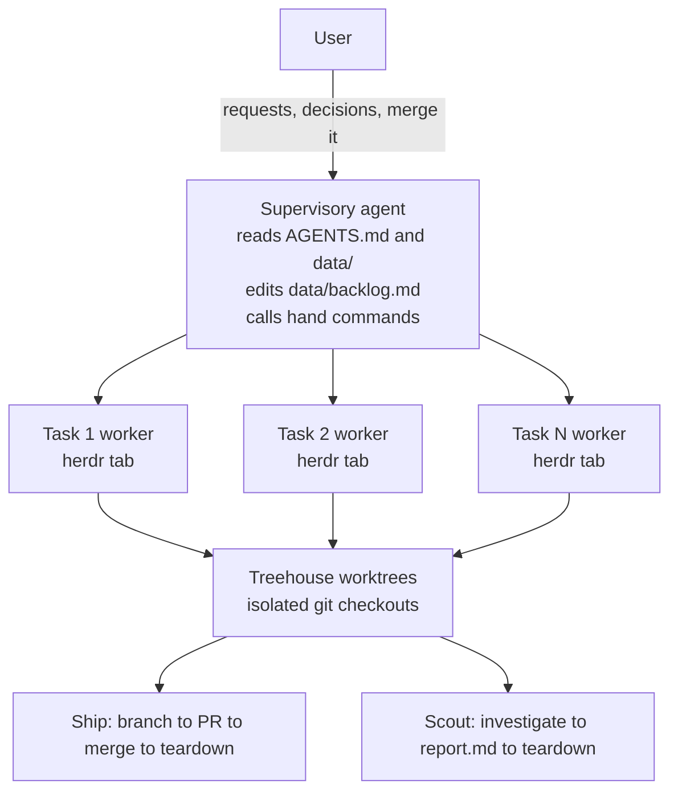

# Secondhand

Talk to one agent. Ship with a crew.

Secondhand is a single Go CLI binary, `hand`, that orchestrates a fleet of coding agents across projects.
A supervisory agent runs in a fleet home - a standalone directory anywhere on disk, or the secondhand checkout itself - records tasks in a markdown backlog, and calls `hand` to spawn autonomous workers into isolated git worktrees.
The CLI owns lifecycle correctness, state management, and process supervision.
It was born from [firstmate](https://github.com/kunchenguid/firstmate), an agent fleet supervisor built as 34K lines of shell, and rebuilds that concept as a clean CLI.

## Quick start

Install `hand` (see "Installation" below for every option), then create a fleet home:

```sh
mkdir ~/fleet
cd ~/fleet
hand init
# Launch any supported harness here; AGENTS.md tells it to run hand session start.
```

`hand init` asks nothing.
It creates runtime directories, skeleton files, and a managed instruction block in `AGENTS.md`, with a `CLAUDE.md` symlink when that name is absent.
The instructions make every supported supervising harness run `hand session start`, which loads the current fleet context and reports the first next action.
That session uses the detected supervisor harness for workers and leaves model and effort selection to that harness's native defaults.
It can register a project with `hand project add <repo-url>`; `hand config set <key> <value>` is only for an explicit persisted worker override.
Detected and native values are effective defaults, not configuration written on your behalf.

A fleet home is a plain directory, anywhere on disk, unrelated to any project's own repo.
`hand init` never places a `hand` binary in it, so install `hand` on `PATH` first.

The worker lifecycle commands are available, including `hand spawn`, `hand status`, `hand send`, and `hand teardown`.

## Set up a fleet home

The maintainers dogfood a fleet home inside the secondhand checkout itself; see [CONTRIBUTING.md](CONTRIBUTING.md) for that setup.

Every `hand` command resolves its fleet home the same way: the `HAND_HOME` environment variable if set, otherwise the current directory or the nearest ancestor holding `state/hand.db`.
`state/hand.db` is the marker because only `hand` ever writes it, so a project clone under `projects/` carrying its own generic top-level `data/` and `state/` never captures the walk up.
Set `HAND_HOME` to run `hand` from outside the fleet home, for example from a script or a different working directory; pointed at a directory that is not a fleet home it refuses rather than falling back.

## Core concepts

- **Projects**: git repositories cloned under `projects/`, registered in `hand`'s machine state and projected to `data/projects.md`. Each has a delivery mode: `no-mistakes`, `direct-pr`, or `local-only`.
- **Tasks**: units of work identified by a unique ID. Ship tasks produce a branch and PR; scout tasks investigate and produce `data/<id>/report.md`.
- **Briefs**: task instructions at `data/<id>/brief.md`, written by the supervisory agent before spawning a worker.
- **herdr tabs**: each worker runs in its own herdr tab. herdr provides semantic agent state (working/idle/blocked/done/unknown) and push events, so no terminal scraping. Herdr state says whether a pane is busy, not whether a task finished.
- **Report channel**: `state/<id>.status` is an append-only file the worker writes and `hand` only reads. It carries the task outcome herdr cannot (working/paused/blocked/needs-decision/done/failed), surfaces in `hand status` and `hand watch`, and auto-records a PR URL the worker reports.
- **treehouse worktrees**: workers operate in isolated git checkouts acquired from a treehouse pool, never in the project clone itself.
- **Backlog**: `data/backlog.md` is a plain markdown task queue, read and edited directly by the supervisory agent. Finished entries roll off into `data/done-archive.md`, dropped ones into `data/note-archive.md`.
- **Operator context and learnings**: `data/operator.md` is written by the operator for the agent to read first - identity, authority, hard constraints - and `data/learnings.md` is the agent's own curated record of operational facts that cost real time to discover. The agent reads `data/operator.md` and never rewrites it, which is what lets its constraints outrank the agent's judgment. `hand init` seeds both, `hand update` seeds whichever an older home is missing, and neither ever overwrites one that exists; nothing under `data/` is maintained by hand for the operator to read, since `hand status` and the issue tracker are their view of the fleet.
- **Supervisor bootstrap**: `hand init` and `hand update` maintain one small `AGENTS.md` block that tells a supervising harness to run `hand session start` and load bounded startup context without reading stdin. Claude reads the same contract through `CLAUDE.md`. A process marked `HAND_ROLE=worker` is refused before context is read; supervisor startup is strictly read-only, so an older state schema requires an explicit `hand init <home>` migration before the overview can load.
- **Agent-shaped output**: every command prints TOON on stdout - `key: value` fields, `name[N]{f1,f2}:` row blocks with pre-computed aggregates above them, and a `help[N]:` list of what to run next - because the consumer is an LLM agent rather than a human terminal, with `hand watch`'s per-line event stream as the one exception. `--fields` narrows a row block to the columns you name, `--json` retains its existing object, and a failure renders its own document on stderr carrying `error`, `kind` and `exit` so a caller branches on a word instead of a number.
- **Machine state vs. the prose corpus**: machine state - tasks, PR state, pane ids, the project registry, holds - is authoritative in sqlite at `state/hand.db`. The prose under `data/` stays authoritative in files, with a derived full-text index at `state/index.db` that `hand search` reads and that is safe to delete at any time. When the database and a `state/<id>.status` file disagree about what a worker said, believe the file: it is readable without a working `hand`, which is what recovery has actually needed.

## CLI overview

| Command | Description | Status |
| --- | --- | --- |
| `hand` | With no subcommand in a fleet home: render the same supervisor startup digest as `hand session start`; outside one, report the binary, version and how to initialize a home | Available |
| `hand init` | Initialize runtime directories, skeleton files and the managed supervisor instructions; asks nothing and persists no worker override | Available |
| `hand config` | Report the effective detected/native worker defaults and optional persisted overrides; `hand config set <key> <value>` validates and persists one override | Available |
| `hand session start` | Canonical supervisor startup: load bounded fleet context and choose the next action; refuses `HAND_ROLE=worker` before reading context and never reads stdin | Available |
| `hand project add` | Clone and register a repository | Available |
| `hand project list` | List registered projects | Available |
| `hand project remove` | Unregister a project, keeping its clone | Available |
| `hand project sync` | Fast-forward project clones to their remote default branch | Available |
| `hand project upstream` | Declare the repo a fork project opens its PRs against, so `hand pr` accepts a PR living there and gate-opened-PR detection looks for one there | Available |
| `hand spawn` | Spawn a worker agent in an isolated worktree | Available |
| `hand status` | Show fleet overview or single-task detail | Available |
| `hand send` | Send a message to a running worker, from an argument or `--file`; waits out a busy composer up to `--wait` instead of failing, and records the message as undelivered when it never reaches the pane | Available |
| `hand hold set` | Record that an id is waiting on a human or on another id; survives the task's teardown, so `hand spawn` refuses to reuse a held id | Available |
| `hand hold clear` | Clear the hold on an id | Available |
| `hand watch` | Blocking watcher that prints actionable fleet events, including a worker gone silent with no herdr transition at all (`parked`), and steers a worker whose harness stopped on a usage limit back into its task once the quota plausibly returned, instead of leaving it dead until someone notices; `--until-event` exits on the first one - narrowed to chosen kinds with `--event` - so the exit itself wakes the supervisory agent, and exits `5` naming any worker it can't reach before arming; one watcher per fleet home, so a second exits `3` naming the incumbent unless it passes `--takeover` | Available |
| `hand merge` | Merge a task's completed work | Available |
| `hand pr` | Record a task's pull request URL | Available |
| `hand search` | Full-text search the prose corpus under `data/` | Available |
| `hand doctor` | Report perishable content and generated-block drift in the fleet home's `AGENTS.md`; fixes nothing | Available |
| `hand deliver` | Record that a task's work is handed off and landing it is someone else's decision, so `hand teardown` accepts it without `--force` and the completion says delivered, not merged | Available |
| `hand teardown` | Clean up a completed task, fail-closed on unlanded work, recording it in `state/completions.jsonl` first | Available |
| `hand promote` | Promote a completed scout task into a ship task | Available |
| `hand notify` | Send an out-of-band notification via a configured command; `hand watch` also calls it in-process for events worth reaching the operator | Available |
| `hand update` | Update the installed binary from the latest GitHub Release; `--check` reports availability without installing | Available |

Run `hand --help` for details on currently available commands.

## Architecture



## Requirements

`hand` itself is a static binary with no runtime dependencies.
It shells out to these tools, and reports the ones it cannot find on `PATH` when you run `hand init` or `hand doctor`:

- [herdr](https://github.com/ogulcancelik/herdr) - terminal multiplexer with semantic agent state; every worker runs in a herdr pane, so spawning needs it
- [treehouse](https://github.com/kunchenguid/treehouse) v2.1.0 or newer - git worktree pool manager; workers are given worktrees leased from it
- [gh](https://github.com/cli/cli) - GitHub CLI, used for every PR and release operation
- [no-mistakes](https://github.com/yes2games/no-mistakes) - validation pipeline, needed only by projects registered in `no-mistakes` mode
- [qmd](https://github.com/tobi/qmd) - semantic search over historical task data, beyond `hand search`'s keyword matching; optional

A worker also needs its own agent harness installed - `claude`, `codex`, `grok`, `pi` or `opencode`.
`hand config` lists the supported ones, which of them are on `PATH`, and which accept a model or effort at launch.

Building from source additionally needs Go 1.26.5 or newer.

`hand` never installs or configures qmd, and every command works without it.
To point it at a fleet home's corpus by hand:

```sh
qmd collection add data/ --name secondhand
qmd context add qmd://secondhand "Task briefs, scout reports, decisions, and backlog history"
qmd embed

qmd search "login auth decision" --json
qmd vsearch "how did we handle the deploy failure" -c secondhand
```

## Installation

From a release, the way most installs should go:

```sh
curl -fsSLO https://github.com/atqamz/secondhand/releases/latest/download/hand-linux-amd64.tar.gz
tar xzf hand-linux-amd64.tar.gz
install -m755 hand ~/.local/bin/hand
```

Releases carry `hand-linux-amd64`, `hand-linux-arm64`, `hand-darwin-amd64` and `hand-darwin-arm64` as `.tar.gz`, alongside a `checksums.txt` to verify against.
The [releases page](https://github.com/atqamz/secondhand/releases) lists every asset.

From nix, either into your profile or for a single command:

```sh
nix profile install github:atqamz/secondhand
nix shell github:atqamz/secondhand -c hand --version
```

The flake covers `aarch64-darwin`, `aarch64-linux` and `x86_64-linux`.
On Intel macOS, use a release binary or `go install`.

From Go:

```sh
go install github.com/atqamz/secondhand@latest
```

That produces a binary named `secondhand`, not `hand`, and embeds no version, so it prints `dev` and never reports available updates.
Rename it or prefer a release asset.

To build a checkout - the path for working on secondhand itself - see [CONTRIBUTING.md](CONTRIBUTING.md).

To update an installed binary, run `hand update`.
It downloads the release asset for the current OS and architecture, verifies its SHA256 checksum, and replaces the running binary in place.
When run inside a fleet home it then refreshes the generated part of that home's AGENTS.md, leaving your own additions untouched, and prints the new release's notes.
`hand update --check` reports whether an update is available without installing it.
Every other command run in a fleet home prints a one-line notice to stderr when a newer release exists, checked at most once a day and cached in `state/.version-check`.
Builds without an embedded version never print the notice.

## Configuration

Optional worker overrides live as plain files under `config/`, one value per file.
`hand config` reports three effective settings - `harness`, `model` and `effort` - and validates any override before writing it atomically:

```sh
hand config                             # effective defaults, optional overrides and harness capabilities
hand config set harness claude
hand config set model claude-opus-5
```

Without `config/harness`, workers inherit the detected supervisor harness. Applicable but unset model and effort values stay with that harness's native defaults; a harness with no such launch flag reports them as `unsupported`.
Only when no supported harness can be detected is the harness `missing`, with model and effort `pending-harness` until that one choice is supplied.
Persisted model and effort overrides are stored per harness (`config/model.claude`), so switching harnesses never hands a worker an identifier chosen for a different tool.

`hand init` writes none of these overrides.
It reports the effective states, and every `hand session start` repeats them so an operator can add an override when one is actually wanted.

A brief can start with a `---` fenced block declaring `model` and `effort` for one task. Those values win over fleet defaults and lose only to a `hand spawn` or `hand promote` flag.

Other optional files tune supervision:

- `notify`: shell command template run with `HAND_MESSAGE` set; `hand notify` reports an error when it is absent.
- `send-wait`: how long `hand send` waits for a busy composer, as a Go duration (default `2m`).
- `watch-interval`: watcher poll interval, as a Go duration (default `5s`).
- `stale-threshold`: seconds without an agent-state transition before `stale` (default `300`).
- `parked-paused-bound`: seconds of report-channel silence after `paused` (default `3600`).
- `parked-done-bound`: seconds of silence after `done` or `failed` (default `5400`).
- `parked-other-bound`: seconds of silence in every other report state (default `1200`).

Workers run their harness interactively so they can be steered and watched.
For Claude Code that means first-run dialogs, and `hand spawn` and `hand promote` answer the workspace-trust and bypass-permissions ones for you, then confirm the worker is actually running before reporting success.
A worker that never comes up fails the spawn instead of being reported as started.
Claude Code's managed-settings approval prompt and Codex's directory-trust prompt are exceptions: each enables settings or policies that can run project or host code, so `hand` refuses to accept the security decision for you and tells you to run the harness yourself once before respawning.

## Contributing

See [CONTRIBUTING.md](CONTRIBUTING.md).

## License

[MIT](LICENSE)
