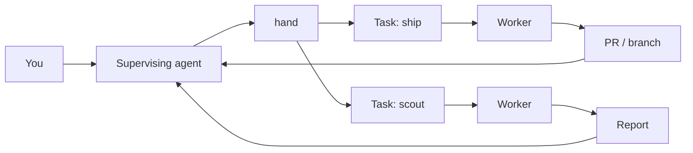
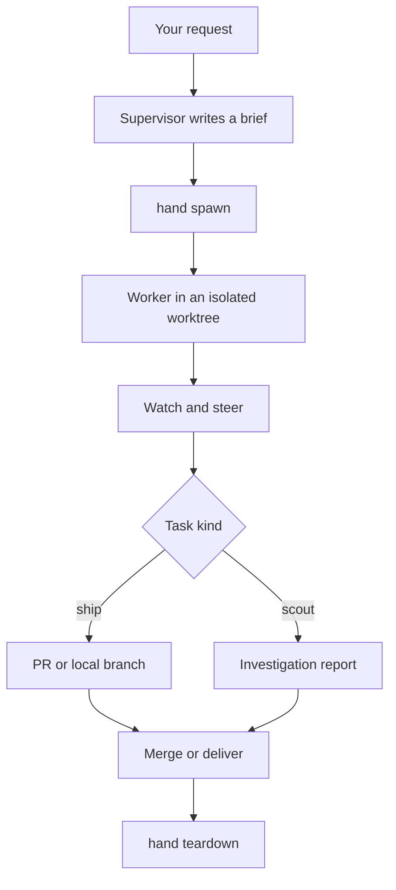
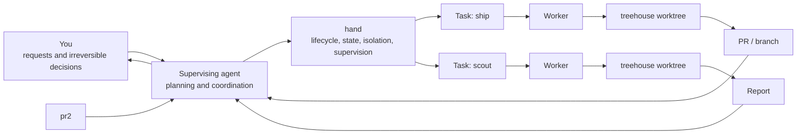

# Secondhand

**You lead. `hand` runs the crew.**

Secondhand turns one coding-agent session into a supervisor for a fleet of coding agents.

You talk to one agent. It plans the work, writes briefs, dispatches workers into isolated git worktrees, watches them, steers them when needed, and brings the results back to you.

`hand` is the CLI underneath that workflow. It owns lifecycle, state, isolation, and process supervision so the supervising agent can focus on judgment and coordination.

The canonical cross-cutting terms for this workflow are defined in [Hand orchestration vocabulary](docs/vocabulary.md).



Secondhand was inspired by [firstmate](https://github.com/kunchenguid/firstmate), rebuilding the same agent-fleet idea as a focused Go CLI.

## Why Secondhand?

Coding agents are good at working on a task. Running several of them reliably is a different problem.

Someone still has to:

- give each worker enough context
- keep concurrent work isolated
- know which worker is running, blocked, or done
- steer a worker without restarting it
- preserve task state across supervising sessions
- decide when work is ready to merge or hand off
- clean up worktrees and processes without losing unfinished work

Secondhand splits those responsibilities cleanly: **the supervisor handles judgment; `hand` handles mechanics.**

## Adoption

### Fastest path

Linux and macOS:

```sh
curl -fsSL https://github.com/atqamz/hand/releases/latest/download/bootstrap.sh | sh
```

Windows PowerShell:

```powershell
irm https://github.com/atqamz/hand/releases/latest/download/bootstrap.ps1 | iex
```

See [docs/adoption.md](docs/adoption.md) for the release binding, consent model, and readiness contract.

### Install `hand` only

Already have a coding-agent harness? See [Installation](#installation) below.

### Manual adoption

```sh
mkdir -p ~/secondhand-fleet
cd ~/secondhand-fleet
hand init
hand doctor
```

See [Quick start](#quick-start) for the full walkthrough.

### Agent-assisted adoption

Already have a capable coding agent and prefer to delegate setup:

```text
Set up Secondhand from atqamz/hand on this machine using its documented
bootstrap workflow. Inspect first, explain any third-party installations
before performing them, preserve existing credentials/configuration, and
finish by running hand doctor.
```

## Quick start

### 1. Install `hand`

From a release:

```sh
curl -fsSLO https://github.com/atqamz/hand/releases/latest/download/hand-linux-amd64.tar.gz
tar xzf hand-linux-amd64.tar.gz
install -m755 hand ~/.local/bin/hand
```

Or with Nix:

```sh
nix profile install github:atqamz/hand
```

See [Installation](#installation) for every supported option.

### 2. Create a fleet home

A fleet home is the directory where the supervising agent lives and where Secondhand keeps fleet state.

```sh
mkdir ~/secondhand-fleet
cd ~/secondhand-fleet
hand init
```

`hand init` is non-interactive. It creates the fleet structure, installs the bundled `secondhand` Agent Skill for supported harnesses, and writes the canonical, Hand-owned `AGENTS.md`: a small, immutable set of invariants telling any supervising harness to run `hand session start` before acting, restored byte-for-byte on every later `hand init`. A `CLAUDE.md` reference is written alongside it when that name is otherwise absent - a symlink on Unix and an `@AGENTS.md` pointer file on Windows.

### 3. Add or create a project

```sh
hand project add https://github.com/you/project
hand project add ~/work/project
hand project create new-project
```

Remote sources are cloned under the fleet home and prepared for isolated worker worktrees.
Local Git sources are adopted once into a separate Fleet-managed clone; Hand never executes in or synchronizes with the original checkout.
Created projects start with one empty `main` baseline commit and are also managed locally.

### 4. Open a supervising session

For Claude Code:

```sh
cd ~/secondhand-fleet
claude
```

The canonical `AGENTS.md` tells the harness to run `hand session start` before responding or acting; that command loads bounded fleet context, returns Fleet-scoped orientation and monitor currentness, reports the first next action, and refuses outright inside a worker's isolated worktree.
When it cannot prove a detached watcher, it reports a bounded re-arm and names `hand watch --until-event`.
Any other supported harness reads the same instructions from `AGENTS.md` directly.

On the first session, the supervisor inspects `hand config`, asks only unresolved configuration policy questions, and persists accepted profile and route choices through the CLI.

### 5. Give it work

Talk to the supervisor normally:

> Fix the login regression. Also investigate why the integration tests are flaky, but do not change anything for that investigation yet.

The supervisor can dispatch the fix as a **ship task** and the investigation as a **scout task**, then coordinate both while you keep talking to one agent.

## How it works



### Ship tasks

Ship tasks make changes. A Task is durable logical work and its worker run is an Attempt with its own disposable execution identity. A worker receives its own git worktree, works independently, and produces a pull request or local branch according to the project's delivery mode.

### Scout tasks

Scout tasks investigate without being expected to ship code. They return `data/<id>/report.md`, and a completed scout can later be promoted into a ship task. Promotion preserves the scout Attempt and starts a new ship Attempt.

### Task kinds and execution classes

Task kind describes the intended deliverable: `scout` produces an investigation or report, while `ship` produces a change that must be landed or explicitly delivered.

Execution class describes how much implementation judgment remains after supervisor planning:

| Class | Meaning |
| --- | --- |
| `mechanical` | The plan is decision-complete; the worker applies the specified changes and verifies them. |
| `standard` | Architecture is decided; ordinary reversible local implementation judgment remains. |
| `deep` | Substantial implementation reasoning remains with the worker. |

Task kind and execution class are orthogonal.
For example, `ship + mechanical`, `ship + standard`, `ship + deep`, and `scout + deep` are meaningful combinations.
Execution classes describe remaining judgment, not task size, line count, file count, worker role, model, or cost.

A supervisor-created execution-class brief records the project revision it was planned against:

```yaml
---
execution_class: mechanical
planned_against: <full commit ID>
---
```

`planned_against` is the full commit ID of the registered project's verified local default branch in `<home>/projects/<project>`.
For `mechanical`, Hand refuses dispatch when that project base no longer matches exactly, before provisioning begins.
For `standard` and `deep`, the value is provenance only and does not trigger the mechanical exact-match refusal.
Because Treehouse may refresh a leased worktree during acquisition, Hand also verifies the acquired worktree `HEAD` against the same commit and refuses to launch when it differs.
Mechanical dispatch also requires a harness capable of carrying the shared mechanical worker guidance; unsupported harnesses fail as a precondition before lifecycle mutation.
The supervisor must re-check the plan and rewrite or revalidate it before recording a new revision.

These fields are optional, so briefs without them and legacy `model`/`effort` front matter retain their existing behavior.
Execution-ready body sections such as goal, verified current state, locked decisions, implementation steps, invariants, tests, verification, non-goals, and stop conditions are recommendations for mechanical briefs, not required syntax.
Classified briefs use the configured execution-profile route for their Task kind and execution class.
The supervisor inspects `hand config`, creates profiles with `hand config profile set`, and binds each kind-and-class combination with `hand config route set`.

## What `hand` manages

### Isolated workers

Every worker operates in a git worktree leased through [treehouse](https://github.com/kunchenguid/treehouse). Workers never edit the registered project clone directly.

### Live supervision

Workers run interactively inside [herdr](https://github.com/ogulcancelik/herdr), so the supervisor can observe semantic agent state, send follow-up instructions with `hand send`, and react to fleet events with `hand watch` without scraping a terminal for meaning.
Send outcomes are recorded against the Attempt and visible in `hand status <id>`; unresolved outcomes require operator judgment before steering again.
The [terminal submission uncertainty decision record](docs/adr/steering-records-terminal-submission-uncertainty.md) owns the outcome and recovery contract.

### Durable fleet state

Machine state lives in SQLite while operator context, briefs, reports, backlog history, and learnings remain plain files. The fleet survives the supervising agent's session, so a later session can pick up where the previous one stopped.
SQLite is durable intent and history, while Git, treehouse, herdr, and worker processes are observed reality.
`hand reconcile` compares those independently owned facts and records `needs-repair` when safe convergence cannot be proven.
The [deterministic reconciliation decision record](docs/adr/deterministic-reconciliation-observes-before-mutating.md) owns the recovery invariants.
`hand status` remains read-only and displays repair markers without attempting cleanup.

Each Fleet home has one opaque, durable Fleet identity in `state/hand.db`.
The identity survives restarts, moving the home, and deleting the user-local registry.
It is never derived from the path, project names, or the current machine.

One OS user may have multiple independent Fleet homes.
`hand fleet` lists homes discovered through the user-local `~/.secondhand/registry.db` registry, including missing homes, identity mismatches, and duplicate copied identities.
The registry is discovery metadata rather than Fleet authority, so a missing registry leaves discovery empty and does not become a global active-Fleet switch.

Copied Fleet databases retain their identity by design.
When the registry can prove that one identity is valid at more than one home, runtime and mutating commands fail closed until the duplicate is resolved by the operator.
This boundary prevents accidental cross-Fleet ownership but is logical isolation, not an OS security boundary.

New Herdr workspaces use a Fleet-scoped named session and label.
Legacy Attempts with an empty or `default` session remain in the legacy Herdr session and are cleaned up only through their exact persisted workspace, tab, and pane identities.

### Safe lifecycle boundaries

`hand` fails closed around destructive or irreversible transitions. Teardown refuses unlanded work unless it was explicitly delivered, and the generated supervisor rules prohibit merging without operator authorization.

### Agent-first output

`hand` is designed primarily for agent callers rather than as a terminal dashboard. Commands return compact structured TOON documents with named fields, aggregates, machine-readable states, and suggested next actions. Read commands that support it retain `--json` as an alternative.

## Project delivery modes

Each registered project has a delivery mode:

| Mode | Workflow |
| --- | --- |
| `direct-pr` | Workers produce normal branches and pull requests. This is the default. |
| `no-mistakes` | Delivery uses [no-mistakes](https://github.com/kunchenguid/no-mistakes) as a gate. |
| `local-only` | Work stays local instead of using a remote pull-request workflow. |

`no-mistakes` is a delivery gate, not a Hand Task kind.
Its internal review, test, documentation, lint, PR, and CI stages remain owned by no-mistakes rather than becoming Hand Task kinds.

Choose a mode when registering a project:

```sh
hand project add https://github.com/you/project --mode direct-pr
```

Add an existing local Git project or create a new managed project with the local-only mode:

```sh
hand project add ~/work/project
hand project add ~/work/project --mode local-only
hand project create new-project
```

Local adoption requires a clean, committed, non-detached Git worktree with a resolvable default branch.
It copies committed state into `projects/<name>` with an independent object store, removes the clone's origin, and leaves the source checkout untouched.
Local projects do not synchronize with their source later.
`hand project sync` reports local projects as skipped, and `hand project set-url` is remote-backed-only.
Use `hand merge --local` to fast-forward local-only work into the canonical managed clone.

For a fork, declare the upstream repository that receives pull requests:

```sh
hand project upstream project-name upstream-owner/project
```

If the repository is renamed or transferred, repoint the registered project without changing its local identity:

```sh
hand project set-url project-name https://github.com/you/renamed-project.git
```

This keeps the project name and `projects/<name>` clone path stable, updates both the registry URL and clone `origin`, and preserves tasks and completion history.
`hand project sync` can also repair a recognized GitHub rename when GitHub reports the canonical repository.

## Worker harnesses

Secondhand can launch workers through:

- Claude Code (`claude`)
- Codex (`codex`)
- Grok (`grok`)
- Pi (`pi`)
- OpenCode (`opencode`)

Without an override, workers inherit the harness detected as the current supervisor; only when none can be detected does `hand config` report the harness as `missing`. Inspect and configure fleet defaults with:

```sh
hand config
hand config set harness claude
hand config set model claude-opus-5
hand config profile set claude --harness claude
hand config route set ship standard claude
```

The `harnesses` table lists supported harnesses and whether each is installed on `PATH`.
Model and effort support depends on the harness: `hand config` reports each as `native-default`, `configured`, or `unsupported` instead of silently storing a setting a harness cannot carry.
Overrides are stored per harness, so switching harnesses never hands a worker a model or effort chosen for a different tool.

Normally, a task brief omits model and effort front matter so its configured route controls execution.
Use those values as explicit overrides only for a genuine task-specific need; explicit spawn or promote flags win over brief values, which win over profile values.

## Fleet home

A fleet home is deliberately separate from the repositories being worked on.

```text
~/secondhand-fleet/
├── AGENTS.md
├── CLAUDE.md
├── .agents/skills/secondhand/
├── .claude/skills/secondhand/
├── .grok/skills/secondhand/
├── .pi/skills/secondhand/
├── config/
├── data/
│   ├── backlog.md
│   ├── operator.md
│   ├── learnings.md
│   └── ...
├── projects/
└── state/
```

The important pieces are:

- `AGENTS.md` - immutable, Hand-owned supervisor invariants; `hand init` restores it byte-for-byte
- `.agents/skills/`, `.claude/skills/`, `.grok/skills/`, `.pi/skills/` - bundled `secondhand` Agent Skill copies for supported harnesses
- `data/operator.md` - your standing constraints and preferences
- `data/backlog.md` - the supervisor's task queue
- `data/learnings.md` - durable operational knowledge discovered by the fleet
- `projects/` - registered project clones
- `state/hand.db` - authoritative machine state
- `state/index.db` - local full-text index of Fleet prose

You normally do not manage these by hand. The supervisor and `hand` own the workflow.

Every command resolves the fleet home from `HAND_HOME` when set, otherwise from the current directory or the nearest ancestor containing `state/hand.db`.

## Requirements

`hand` itself is a self-contained Go binary.
Operating a fleet uses a private, pinned Git, Treehouse, and Herdr runtime under `~/.secondhand/`.
The runtime is selected by absolute path and does not require persistent `PATH` changes.

- at least one supported coding-agent harness

Projects using `direct-pr` or `no-mistakes` delivery also require [gh](https://github.com/cli/cli) for GitHub operations.

Optional:

- `sh` - a POSIX-compatible shell, required when a non-empty `config/notify` is configured, including on Windows
- [no-mistakes](https://github.com/kunchenguid/no-mistakes) - required only by projects using `no-mistakes` mode
- [qmd](https://github.com/tobi/qmd) - semantic search over historical fleet context beyond `hand search`

`hand runtime status` reports the selected private runtime without mutating the machine.
`hand runtime ensure` explicitly installs or repairs the exact locked bundle and works before a Fleet exists.
`hand doctor` reports runtime identity and readiness separately from optional integrations, external harnesses, project gates, routing, and fleet health.
Its structured output also exposes the `ready`, `blocking`, and `next` fields.

`hand integration list` reports the closed optional capability catalog without downloading anything.
`hand integration install <id> --path <executable>` copies an explicitly installed optional executable into the private store without changing `PATH`.
`hand integration remove <id>` removes the selected optional capability while retaining its versioned payload for recovery.

Building from source additionally requires Go 1.26.5 or newer.

## Installation

### Homebrew

```sh
brew install atqamz/tap/hand
```

### Nix

Install into your profile:

```sh
nix profile install github:atqamz/hand
```

Or run it without installing:

```sh
nix shell github:atqamz/hand -c hand --version
```

The flake covers `aarch64-darwin`, `aarch64-linux`, and `x86_64-linux`. On Intel macOS, use a release binary, the install script, or `go install`.

### Go

```sh
go install github.com/atqamz/hand@latest
```

`go install` does not embed release-version metadata, so the binary reports `dev` and never checks for updates. Prefer a release binary, Homebrew, or Nix for a versioned build.

### Install script

Checksum-verifying installers for Linux, macOS, and Windows. Each installs `hand` only - never Herdr, Treehouse, `gh`, an agent harness, or no-mistakes.

```sh
curl -fsSL https://raw.githubusercontent.com/atqamz/hand/main/install.sh | sh
```

```powershell
irm https://raw.githubusercontent.com/atqamz/hand/main/install.ps1 | iex
```

`HAND_INSTALL_DIR` overrides the install directory (`$HOME/.local/bin` on Linux/macOS, `%LOCALAPPDATA%\hand` on Windows); `HAND_INSTALL_VERSION` pins a release tag instead of the latest.

To also initialize a fleet home in one step, see [Adoption](#adoption) above.

### Release binary

Release tar archives are available for Linux and macOS on AMD64 and ARM64. A ZIP archive is available for Windows AMD64. Every release includes `checksums.txt` for `hand update` and direct archive verification.

```sh
tmp=$(mktemp -d)
trap 'rm -rf "$tmp"' EXIT
tag=v0.6.0 # replace with the exact release you intend to verify
curl -fsSL "https://github.com/atqamz/hand/releases/download/$tag/hand-linux-amd64.tar.gz" -o "$tmp/hand-linux-amd64.tar.gz"
curl -fsSL "https://github.com/atqamz/hand/releases/download/$tag/checksums.txt" -o "$tmp/checksums.txt"
want=$(awk '$2 == "hand-linux-amd64.tar.gz" { print tolower($1); exit }' "$tmp/checksums.txt")
if command -v sha256sum >/dev/null 2>&1; then
  got=$(sha256sum "$tmp/hand-linux-amd64.tar.gz" | awk '{ print tolower($1) }')
else
  got=$(shasum -a 256 "$tmp/hand-linux-amd64.tar.gz" | awk '{ print tolower($1) }')
fi
[ "$got" = "$want" ]
tar xzf "$tmp/hand-linux-amd64.tar.gz" -C "$tmp"
install -m755 "$tmp/hand" ~/.local/bin/hand
```

On Windows, download `hand-windows-amd64.zip` and `checksums.txt` for one exact release tag, compare the checksum with `Get-FileHash -Algorithm SHA256`, then extract `hand.exe` and place it on `PATH`.

See the [releases page](https://github.com/atqamz/hand/releases) for every asset.

### Edge builds

Edge is a rolling GitHub prerelease for maintainers and contributors who want the newest CI-verified `main` build.
It is intentionally mutable and may contain unreleased behavior or state/schema changes.
Stable users should continue using the normal release assets above.

Install the Linux AMD64 edge asset directly:

```sh
curl -fsSLO https://github.com/atqamz/hand/releases/download/edge/hand-linux-amd64.tar.gz
tar xzf hand-linux-amd64.tar.gz
install -m755 hand ~/.local/bin/hand
```

Opt into edge from an existing installation:

```sh
hand update --channel edge
```

Check for an edge update without installing it:

```sh
hand update --check --channel edge
```

After an edge binary is installed, plain `hand update` continues tracking edge.
Switch back explicitly with `hand update --channel stable`.
That switch is a downgrade from unreleased development state, so it may not be runtime-compatible with every future migration performed while using edge.

To build a checkout for contributing to Secondhand itself, see [CONTRIBUTING.md](CONTRIBUTING.md).

## Notifications

Configure notifications by writing a text file at `config/notify`.
The file contains a POSIX shell snippet, and the notification text is available as `$HAND_MESSAGE`.

For every supported operating system, the execution contract is:

```text
config/notify -> POSIX sh -c
```

This applies on Linux, macOS, and Windows.
On Windows, Hand does not reinterpret the template as `cmd.exe` batch syntax, PowerShell, or WSL shell syntax, and it does not invoke `wsl.exe` automatically.
A POSIX-compatible `sh` executable must be directly resolvable from the Windows process's `PATH`.
Git for Windows and MSYS2 are examples of environments that may provide such an executable, but installing WSL alone does not satisfy this requirement.

Literal Windows paths are still part of POSIX shell source.
For example, users should not assume this is safe template source:

```text
C:\some\path\notifier.exe
```

Backslashes have meaning to POSIX shells, so quote or escape literal paths according to POSIX shell rules, or use a shell-compatible representation such as a forward-slash Windows path when supported.
Hand does not rewrite paths or automatically escape arbitrary template source.

## Command map

You normally let the supervising agent drive the CLI. The main lifecycle is:

| Command | Purpose |
| --- | --- |
| `hand init` | Create or refresh a fleet home. |
| `hand project add <source>` | Clone a remote Git source or adopt a local Git source into the fleet. |
| `hand project create <name>` | Create a new empty Git-backed local-only project with a real baseline commit. |
| `hand project set-url <name> <repo-url>` | Recover a registered project after a repository rename or transfer while preserving its local identity and task history. |
| `hand project sync [name]` | Fast-forward remote-backed clones; report local-managed projects as skipped. |
| `hand spawn` | Dispatch a worker into an isolated worktree. |
| `hand reopen <id>` | Reopen a terminal Task by creating a new Attempt. |
| `hand status` | Read fleet or task state. |
| `hand fleet` | List user-local Fleet homes and their observed identity state. |
| `hand ack <id> [--reason <text>]` | Record that a supervisor has acknowledged a task's report. |
| `hand reconcile [id] [--abandon-worktree] [--abandon-pane] [--attempt-never-started]` | Reconcile one Task or the bounded fleet candidate set with observed external reality; given a Task ID, explicitly relinquish a historical worktree lease or Herdr pane identity whose ownership no observation can settle, or attest that a running Attempt's worker took no turn so the ordinary release path can end it. |
| `hand watch` | Wait for actionable fleet events and emit Fleet-scoped structured wake hints. |
| `hand send` | Steer a running worker. |
| `hand merge` | Merge completed work after authorization. |
| `hand deliver` | Mark work as handed off when landing is someone else's decision. |
| `hand teardown` | Clean up a completed task safely while preserving Task and Attempt history. |

Other commands cover session bootstrap, configuration, project sync and upstreams, holds, scout promotion, search, notifications, diagnostics, PR recording, and self-update.

Run `hand --help` for the authoritative command reference.

Running bare `hand` returns the resolved fleet home, worker configuration, and live fleet overview rather than a generic help screen.

## Updating

Release installations can update themselves:

```sh
hand update
```

Check without installing:

```sh
hand update --check
```

Without `--channel`, the installed build determines the target channel.

| Installed build | `hand update` target |
| --- | --- |
| stable | stable |
| edge | edge |
| dev | stable |

Use `--channel stable` or `--channel edge` for an explicit target or channel switch.
The edge channel compares embedded commit identities, while stable compares release SemVer versions.

When run inside a fleet home, an update also restores `AGENTS.md` to the canonical content the new build ships, archiving any pre-immutable content it finds the first time. Other commands check the installed build's channel for a newer build at most once a day and print a one-line notice when one is available.

## Architecture

Secondhand deliberately separates judgment from mechanics.



The supervisor owns planning and judgment. `hand` owns lifecycle, state, isolation, and supervision. Workers own individual tasks. You remain the authority for irreversible decisions.

For durable architectural rationale, see [`docs/adr/`](docs/adr/). Behavioral command contracts live with their implementation, help, and focused tests.

## Contributing

See [CONTRIBUTING.md](CONTRIBUTING.md).

The short path is:

```sh
git clone https://github.com/atqamz/hand
cd hand
nix develop
make build
make lint
make test
```

Run `make e2e` when changing CLI behavior. Secondhand uses conventional commits and release-please for versioning and changelogs.

## License

[MIT](LICENSE)
